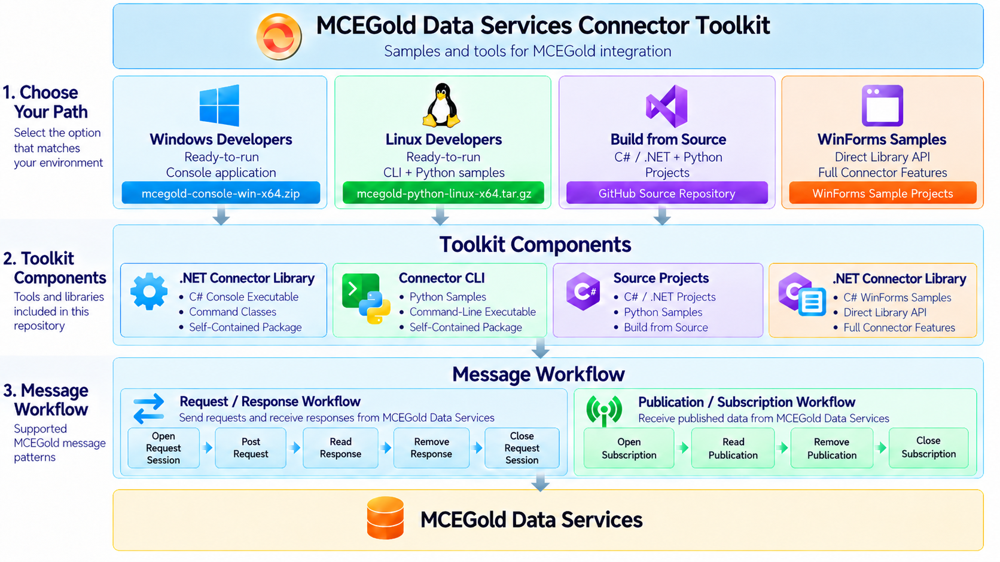

# MCEGold Data Services Connector Toolkit

Public tools, samples, configuration templates, and request payloads for learning and using the `MCEGold.Data.Services.Connector` package.

## Choose Your Path

### Windows Developers

Use the ready-to-run, self-contained C# Console when you want an interactive Windows workflow without installing .NET separately.

1. Download `mcegold-console-win-x64-v1.0.0.zip` from [GitHub Releases](https://github.com/PdMA-Corporation/temp-MCEGold.Data.Services.Connector.Toolkit/releases/latest).
2. Extract it, copy `appsettings.example.json` to `appsettings.Development.json`, and enter your connection values.
3. Run `MCEGold.Data.Services.Connector.Console.exe`.

See the [Windows Console guide](docs/windows-console.md).

### Linux Developers

Use the self-contained Python + Connector CLI package when you want scriptable examples and an explicit staged lifecycle.

1. Download `mcegold-python-linux-x64-v1.0.0.tar.gz` from [GitHub Releases](https://github.com/PdMA-Corporation/temp-MCEGold.Data.Services.Connector.Toolkit/releases/latest).
2. Extract it, copy `configs/connector.config.example.json` to `configs/connector.config.development.json`, and enter your connection values.
3. Run the CLI or follow the numbered Python samples.

See the [Linux / Python guide](docs/linux-python.md).

### Build from Source

The repository contains the C# Console, Connector CLI, Python samples, WinForms samples, documentation, JSON schemas, and request payloads. Install the .NET 8 SDK, then follow [Build from Source](docs/source-development.md).

### WinForms Samples

The WinForms projects are .NET Framework source/reference samples intended for Visual Studio. They are not self-contained release packages. See [WinForms Samples](docs/legacy-winforms.md).

## Supported Workflows

- **Request / Response:** open a request session, post a request, read and remove its response, and close the session.
- **Publication / Subscription:** open a subscription, read and remove a publication, and close the subscription.
- **Automation:** call the Connector CLI directly from PowerShell, Python, shell scripts, or another subprocess-based client.

The Console provides interactive workflows. The Python samples and staged CLI commands expose each lifecycle operation explicitly; atomic CLI convenience commands are also available.

## Quick Configuration

CLI and Python users copy `configs/connector.config.example.json` to `configs/connector.config.development.json`. Console users copy `appsettings.example.json` to `appsettings.Development.json` in the package or Console project folder.

Set the HTTPS connector `host`, authentication scheme, and credentials in the local development file. Configure publication or request channels only when your environment requires them. See [Configuration](docs/configuration.md) for the supported shapes, precedence rules, and secret-handling guidance.

## Documentation

| Need | Documentation |
|---|---|
| Pick a first path | [Getting Started](docs/getting-started.md) |
| Run the Windows package | [Windows Console](docs/windows-console.md) |
| Run the Linux package and Python samples | [Linux / Python](docs/linux-python.md) |
| Build the projects | [Build from Source](docs/source-development.md) |
| Open the .NET Framework samples | [WinForms Samples](docs/legacy-winforms.md) |
| Configure the Toolkit | [Configuration](docs/configuration.md) |
| Find a CLI command or option | [CLI Reference](docs/cli-reference.md) |
| Script the CLI and parse results | [Calling the Connector CLI](docs/calling-mcegold-cli.md) |
| Follow the staged request lifecycle | [Request Workflow](docs/request-workflow.md) |
| Follow the staged publication lifecycle | [Publication Workflow](docs/publication-workflow.md) |
| Choose a request type and payload | [Request Types](docs/request-types.md) |
| Parse the CLI result envelope | [CLI JSON Contract](docs/json-contract.md) |
| Inspect detailed input/output shapes | [Advanced CLI JSON Shapes](docs/connector-cli-json-shapes.md) |
| Compare packages and source archives | [Releases](docs/releases.md) |
| Resolve common setup issues | [Troubleshooting](docs/troubleshooting.md) |

## Repository Structure

- `configs/` - public Connector CLI and Python configuration template.
- `docs/` - setup guides, command and JSON references, and JSON schemas.
- `payloads/requests/` - short-form request payload examples.
- `samples/csharp/MCEGold.Data.Services.Connector.Console/` - interactive C# Console.
- `samples/csharp/MCEGold.Data.Services.Connector.Cli/` - automation CLI used by Python and shell callers.
- `samples/python/` - numbered Python wrappers for the staged workflows.
- `samples/csharp/MCEGold.Request.Consumer/` and `samples/csharp/MCEGold.Publication.Consumer/` - WinForms source samples.

## Security

Do not commit development config files, credentials, tokens, raw service responses, or local state. Public templates contain placeholders only. Use ignored local files such as `configs/connector.config.development.json` and `appsettings.Development.json`, or supply secrets through approved environment variables or secret files.

## License

MIT. See [LICENSE](LICENSE).
